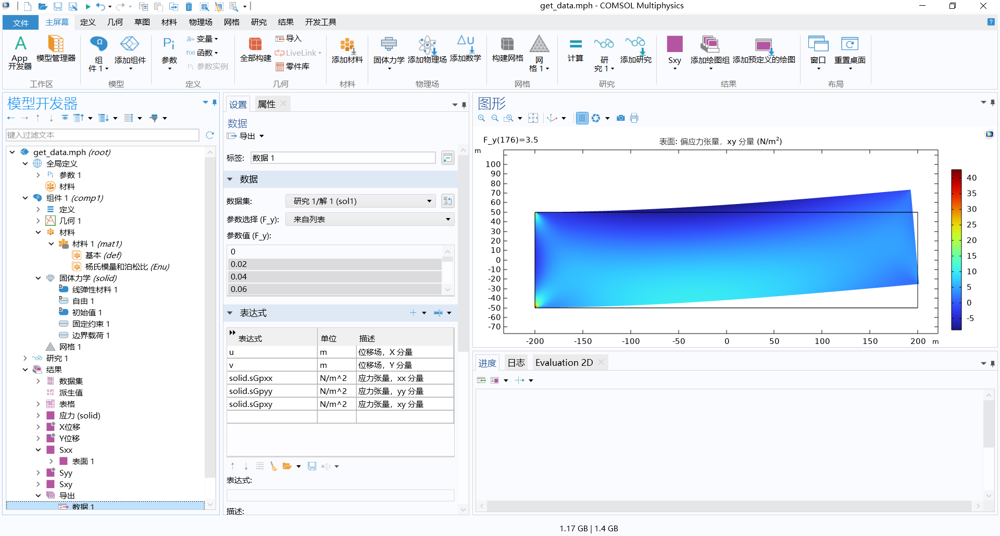
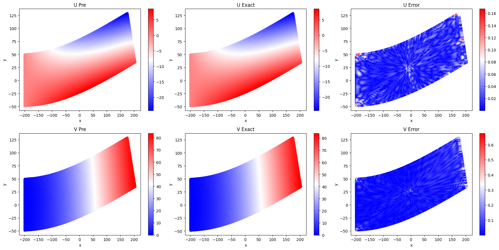
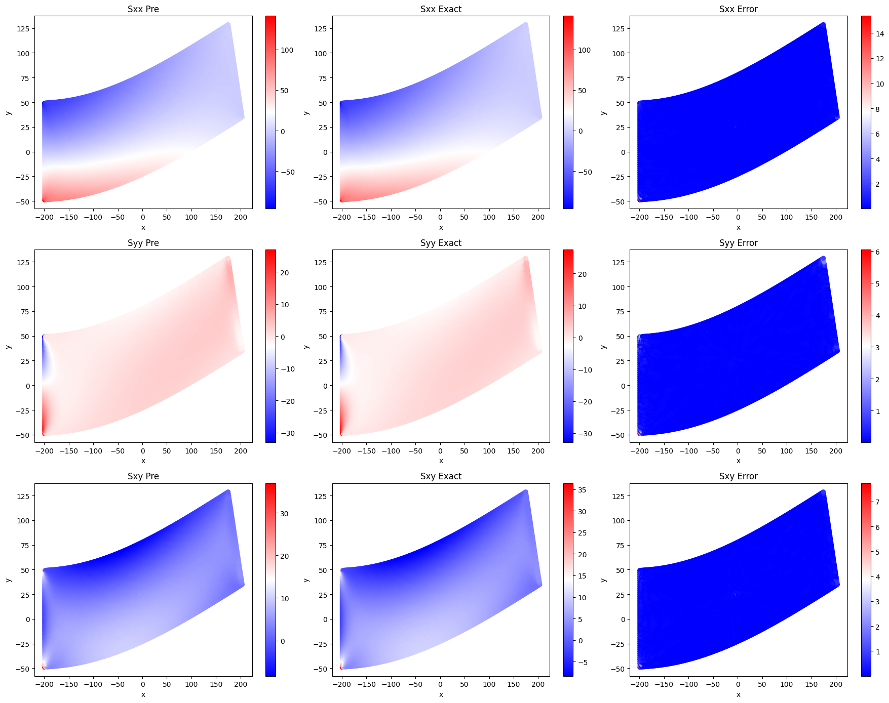
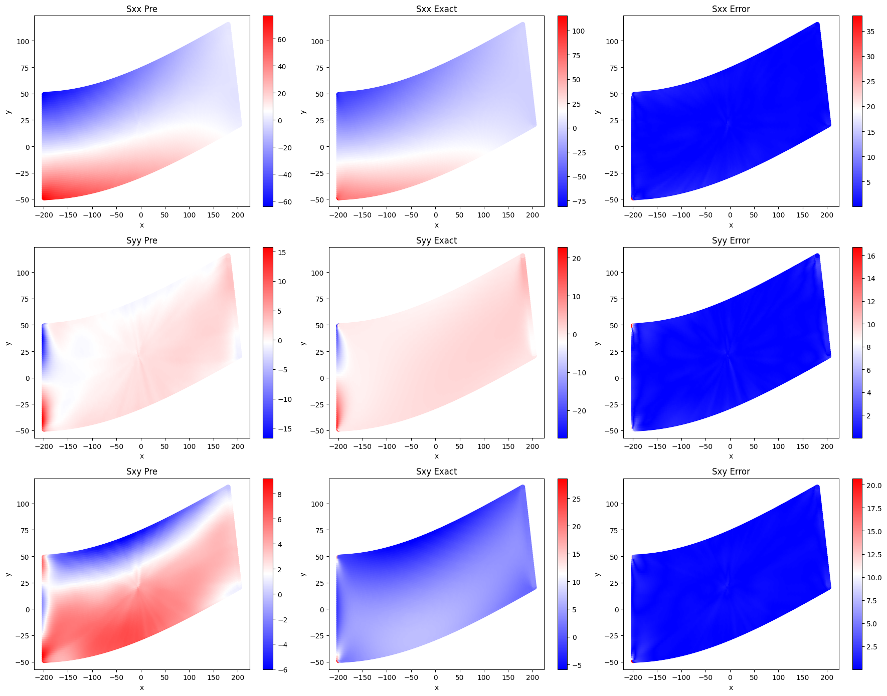
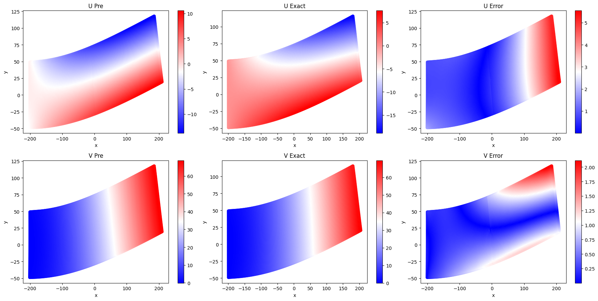

# Need-help-with-PINN-and-DeepONet
Need help with PINN and DeepONet

我尝试使用DeepONet学习一个简单的线弹性问题，问题设置如下：
1. 悬臂梁长-200 ~ 200 m，宽-50 ~ 50 m
2. 左端固定，右端有恒定大小的力f从0~5 $N/m^2$，0.02为步长生成250组不同力下的数据
3. 杨氏模量1000 Pa，泊松比0.3
4. 选择线弹性材料

在Comsol中计算并导出数据，如下：

数据形式如下：

在DeepONet_Elastic_2D_250.html文件为仅计算更新data_loss的普通DeepONet，最终得到结果如下：
1. 应变 $Total Loss = 0.00313275; RMSE U = 0.00299565; RMSE V = 0.00118846$

2. 应力 $Total Stress Loss = 0.0386179; RMSE Sxx = 0.00687969; RMSE Syy = 0.0408957; RMSE Sxy = 0.0190056$

纯数据驱动情况下表现比较良好。
构建PDE损失：
1. 动力平衡方程：
$0=\nabla \cdot S+F_v$
2. 应力应变关系：
$\sigma_{xx}=\frac{E}{1-v^2}(\epsilon_{xx}+v\epsilon_{yy})$
$\sigma_{yy}=\frac{E}{1-v^2}(\epsilon_{yy}+v\epsilon_{xx})$
$\sigma_{xy}=\frac{E}{2(1+v)}\epsilon_{xy}$

随后添加pde_loss，文件piDeepONet_Elastic_2D.ipynb，计算结果比较崩坏：
1. 应变

2. 应力

找不到Bug，拼尽全力也无法战胜，求大佬帮忙看看代码，邮箱：fan.s.y@qq.com
